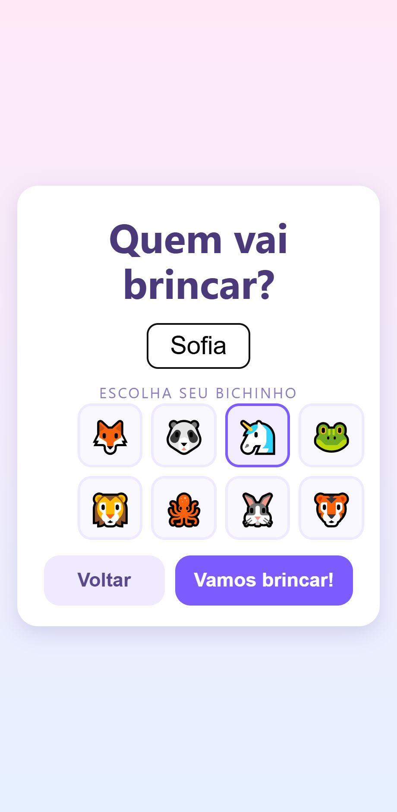
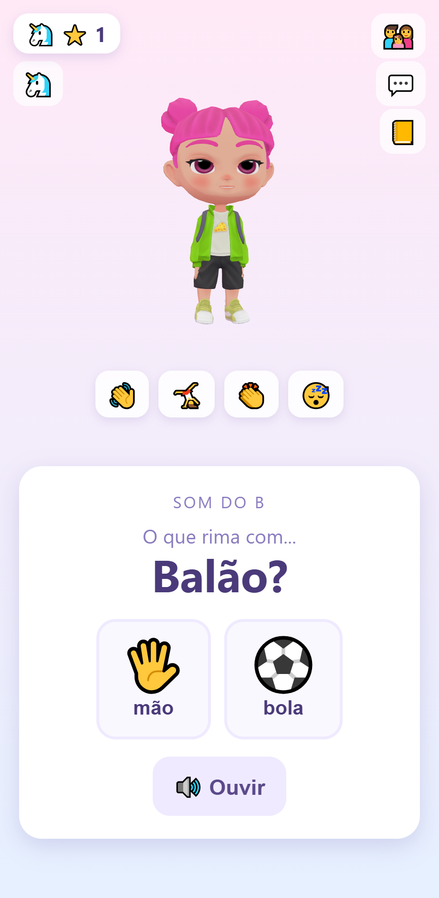
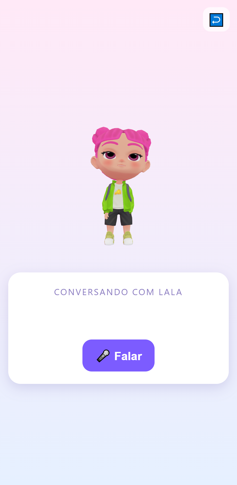
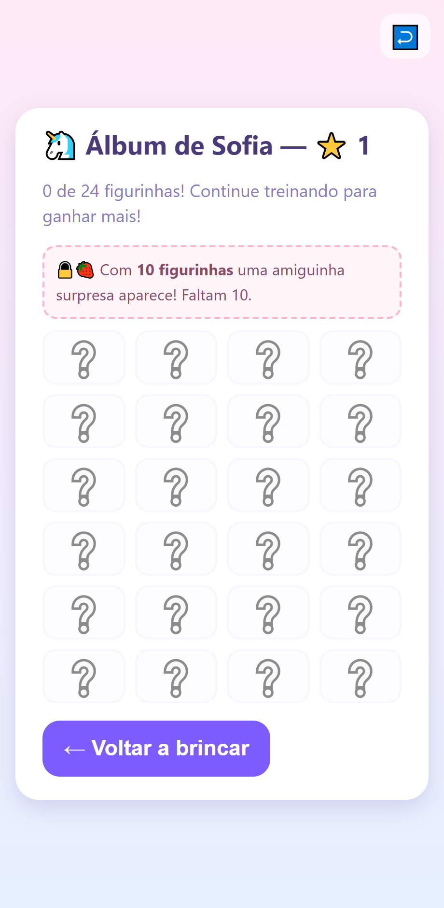

# Laleo

Aplicativo open source de apoio ao desenvolvimento da fala de **crianças de 3 a 10 anos**.
Reúne exercícios de fonoaudiologia gamificados, um avatar 3D interativo que fala e reage, e
conversa com IA — tudo em português do Brasil. Roda na web (PWA) e está preparado para
empacotamento como app Android/iOS.

O nome vem do grego *laleō* (λαλέω), "falar", e junta os dois amiguinhos originais do app:
**Lala** e **Leo**.

> **Aviso importante.** O Laleo é uma ferramenta de apoio e **não substitui** a avaliação e a
> terapia conduzidas por um(a) fonoaudiólogo(a). O conteúdo (palavras, pares mínimos, rimas e
> progressão) ainda **depende de validação clínica** antes do uso real com crianças — veja
> [docs/validacao-clinica.md](docs/validacao-clinica.md).

<table>
  <tr>
    <td align="center"><br><sub>Escolher o amiguinho</sub></td>
    <td align="center"><br><sub>Exercício guiado pelo avatar</sub></td>
    <td align="center"><br><sub>Conversa com IA</sub></td>
    <td align="center"><br><sub>Álbum de figurinhas</sub></td>
  </tr>
</table>

## Recursos

- **Quatro tipos de exercício fundamentados em metodologia fonoaudiológica**
  (ver [docs/metodologia.md](docs/metodologia.md)):
  - *Ouça e repita* — o avatar demonstra a palavra, a criança repete e a fala é analisada.
  - *Pares mínimos* — escolher a figura correspondente à palavra falada (contraste fonológico).
  - *Rima* — consciência fonológica, sempre respondida em voz alta.
  - *Escuta* — bombardeio auditivo, apenas ouvir, sem pressão de produção.
  - São 49 exercícios cobrindo os fonemas R, S, CH, LH, L, F, V, J, Z, G e C, além dos
    encontros consonantais BR, TR e PR.
- **Análise de pronúncia real** com Whisper (transcrição pt-BR) — não é simulação.
- **Avatar 3D (formato VRM)** com voz neural pt-BR processada **inteiramente no dispositivo**:
  nenhum áudio sai do aparelho. Inclui lipsync pela amplitude do áudio, animações de corpo
  inteiro (acenar, pular, aplaudir, pensar, dormir), reação ao toque e cochilo por inatividade.
- **Três personagens** — Lala e Leo, mais a Moranguinha, que é **desbloqueada quando a
  criança completa 10 figurinhas** (recompensa de longo prazo). Cada um tem voz coerente,
  ajustada por *pitch shift* que preserva a duração da fala (a palavra sai mais aguda, porém
  clara e no ritmo natural).
- **Conversa livre com IA** (Claude), com guardrails de conteúdo infantil aplicados no
  backend. Funciona em modo demonstração sem chave e passa a usar o Claude ao configurá-la.
- **Gamificação leve** — estrelas por acerto e um álbum de 24 figurinhas surpresa (uma a cada
  cinco estrelas), com celebração ao desbloquear.
- **Perfis por criança** — progresso, estrelas e álbum independentes.
- **Área dos responsáveis** protegida por PIN, com relatório de progresso por fonema.

## Arquitetura

| Módulo | Stack | Papel |
|--------|-------|-------|
| `backend/` | Java 17, Spring Boot 4, H2 (dev) / PostgreSQL (prod) | API REST na porta 8081: exercícios, progresso, gamificação e gateway de IA |
| `frontend/` | React, TypeScript, Vite, three.js + @pixiv/three-vrm, Capacitor | Telas, avatar 3D, voz neural e captura de áudio (PWA) |
| `speech-service/` | Node, Whisper (transformers.js) | Transcrição e nota de pronúncia por fonema (porta 8090) |
| `docs/` | Markdown | Arquitetura, metodologia e validação clínica |

Fluxo de um exercício: o avatar fala a palavra, a criança grava a repetição, o áudio é
convertido em WAV no navegador e enviado ao backend, que aciona o serviço de fala (Whisper);
a nota por fonema retorna, o avatar reage e o progresso é salvo. **A chave da IA e o áudio da
criança nunca chegam ao cliente.** Detalhes completos em
[docs/arquitetura.md](docs/arquitetura.md).

## Como rodar

Pré-requisitos: **JDK 17** e **Node 20 ou superior**. O projeto inclui uma cópia do Maven em
`tools/`, então não é necessário instalá-lo à parte.

```bash
npm start
```

O `npm start` faz tudo: instala as dependências do frontend na primeira vez, builda o projeto
(erros de código aparecem antes de subir), inicia backend (porta 8081) e frontend juntos com
logs identificados, e abre o navegador sozinho quando o app responde. No Windows também dá
para dar **duplo clique em `Iniciar-Laleo.cmd`**. Para desenvolvimento contínuo, `npm run dev`
pula a etapa de build. No Windows o script localiza o JDK 17 automaticamente; em outros
sistemas, defina `JAVA_HOME` caso o backend não suba.

O serviço de fala é opcional e pode subir à parte com `npm run dev:fala`. Sem ele, o backend
usa uma análise de reserva e o aplicativo continua funcionando.

### Ligando o Claude

A conversa funciona em modo demonstração (respostas locais) por padrão. Para usar o Claude,
crie uma chave em [console.anthropic.com](https://console.anthropic.com) e exporte-a antes de
subir o backend — a chave **existe apenas no servidor**:

```bash
export LALEO_IA_CHAVE=sk-ant-...   # modelo em laleo.ia.modelo (padrão claude-opus-4-8)
```

## Créditos e licenças dos assets

- Avatares: **Juanita** (a Lala), **StrawberryPrincess** (a Moranguinha) e **DinoKid**
  (o Leo) — todos da coleção 100Avatars da Polygonal Mind, CC0.
- Animações VRMA: *idle* de **pixiv/ChatVRM** (MIT) e demais de **tk256ailab/vrm-viewer** (MIT).
- Voz: **Piper TTS** (`pt_BR-faber-medium`) via `@mintplex-labs/piper-tts-web`.
- Transcrição: **Whisper** via `@huggingface/transformers`.

## Roadmap

- Validação clínica do conteúdo com fonoaudiólogo(a) — prioritário.
- Empacotamento como app Android/iOS com Capacitor.
- Pontuação de pronúncia por fonema (GOP), além da transcrição.
- Ciclos completos de Hodson e novas interações.

## Licença

Código sob licença MIT. Os assets de terceiros mantêm suas licenças originais, indicadas acima.

---

Status: **MVP funcional**, jogável de ponta a ponta na web. Conteúdo aguardando validação clínica.
